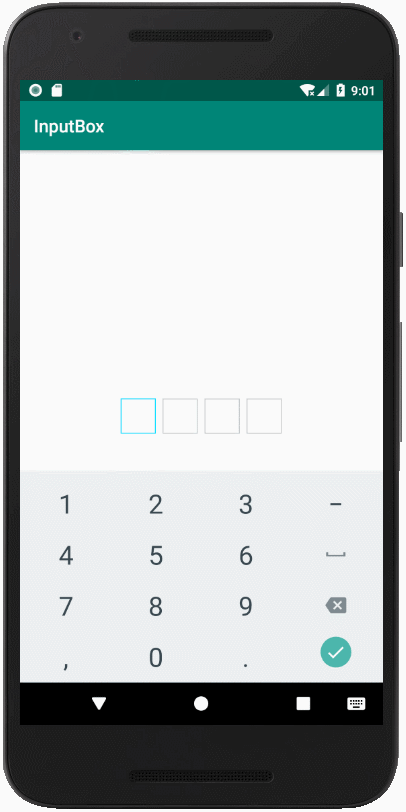

# InputBoxLayout
类似方框的输入EditText管理布局




* [  ](https://bintray.com/lubin/LubinBottomTabBar/InputBoxLayout/_latestVersion)


### 使用

```java
compile 'com.lubin.widget:inputboxlayout:0.5.1'
```
### xml中使用
```xml
    <com.lubin.widget.InputBoxLayout
        android:id="@+id/boc_layout"
        android:layout_centerInParent="true"
        android:layout_width="wrap_content"
        app:box_width="40dp"
        app:box_height="40dp"
        app:box_account="4"
        app:box_margin="4dp"
        app:box_inputType="number"
        app:box_textCoclor="#000"
        app:box_background="@drawable/ic_launcher_background"
        app:box_textSize="12sp"
        android:layout_height="wrap_content"/>
```
### 注释
```markdown
        //输入框的宽度
        app:box_width="40dp"
        
        //输入框的高度
        app:box_height="40dp"
        
        //输入框的数量
        app:box_account="4"
        
        //输入框间的距离（两个之间是设置的2倍）
        app:box_margin="4dp"
        
        //输入框可输入的类型（number：数字、text、phone）
        app:box_inputType="number"
        
        //文字颜色
        app:box_textCoclor="#000"
        
        //输入框的背景
        app:box_background="@drawable/ic_launcher_background"
        
        //文字大小
        app:box_textSize="12sp"
```
* ic_launcher_background.xml

```xml
<?xml version="1.0" encoding="utf-8"?>
    <selector xmlns:android="http://schemas.android.com/apk/res/android">
        <item android:state_focused="false">
            <shape>
                <size android:width="50dp" android:height="50dp" />
                <stroke android:width="1dp" android:color="#CCCCCC" />
            </shape>
        </item>
        <item android:state_focused="true">
            <shape>
                <size android:width="50dp" android:height="50dp" />
                <stroke android:width="1dp" android:color="#00DEFF" />
            </shape>
        </item>
    </selector>
```

* 调用方法

````java
layout.setOnBoxListener(new InputBoxLayout.OnBoxListener() {
            @Override
            public void onIsOrNotComplete(boolean isComplete, String text) {
                //isComplete 是否所有的输入框都输入了
                //text 输入的内容
            }
        });
````


